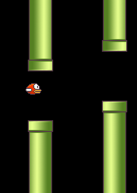
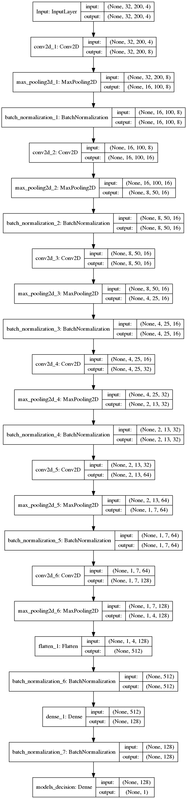

#	World's first immortal Flappy Bird 🐦 bot based on neural networks
I checked my bots over half a million pipes each - 10s of millions of frames - and the bird survived all of them 😌. This is why I concluded that these bots might as well run for ∞ number of frames 🎞, as statistically the bots've been in just about any situation already and haven't failed. Many have attempted to solve Flappy Bird game with neural nets and other machine learning methods before, but fell short of making an immortal bot. My neural network is also one of the lightest, or exactly the lightest - under 1MB.

While making an immortal bot for Flappy Bird 🐦 game is actually some 100x simpler, more efficient and faster without the use of neural networks, but by hand-coding features and flight logic, this was simply my first adventure into trying out reinforcement learning using neural networks. As you open up this world of tasks to yourself it becomes clear that it's great if you can first learn through experimentation on simpler _toy problems_ before moving to the more difficult ones. That principle applies to both - human learning in real life and to machine learning equally well.

Also, this solution is definitely general enough to be able to solve more challenging scenarios of Flappy Bird game and to solve more difficult games.

If you're into neural nets, or machine learning generally, here's a brief summary of my findings without even sprinkles of overcomplicated maths and jargon.

#	How to check if this is true?
`python test.py` it's okay to run it on a CPU, or GPU.

#	Dependencies
1.	Python 2.7
2.	[Install TensorFlow](https://www.tensorflow.org/install/)
3.	`sudo apt-get install graphviz`
4.	`sudo pip install numpy keras scikit-image pygame pydot graphviz` or, maybe, `pip install numpy keras scikit-image pygame pydot graphviz`
5.	`git clone https://github.com/ibmua/immortal-flappy.git`

In saved_models directory you'll be able to find the networks you train and their visualizations. Visualizations are what `graphviz` and `pydot` are required for.

Porting to a backend other than TFlow should be easy with Keras, if you'll do that, please, send a PR request to also include your ported version, or give a link to your repo with the port. Also ports to PyTorch or other frameworks are welcome! Should also be pretty easy, since I'm not using a lot of Keras here and the network which is the only thing I'm using Keras for is extremely simple.

If you have a decent amount of RAM, say 10GB free at least, `flap.py` is the trainer. If you don't, first change `memory_capacity` inside it's code to a much smaller value, so that it would fit your RAM.

##	The Game

I'm sure you've noticed that the interface is a cut-down version of the original game 🕹. It helps make things easier for the neural network by cutting out informational noise, but I'm certain that you can use all of the same methods to tackle Flappy Bird 🐦 game with a more informationally polluted usual interface. You can attempt this yourself and report your results. Possibly, you'd have to increase the network size and the amount of training data, but even if so, most likely not by a lot. Note that the current neural network wasn't highly optimized, I'm sure you can cut it down significantly, or branch it into groups at different points with the bot then still learning well enough to become immortal. I've used this interface, because it simply was a part of the solution I forked when I started working on this.

#	How to reproduce results
The whole process takes about 24h with NVidia GTX 1080, including the time required to make yourself "99.9%" certain that the network you've trained is infallible. The process is divided into steps and you can easily parallelize across GPUs by simply launching the same step in seperate processes running on different GPUs, including, if wanted, on different computers. So if you've got 8 GTX 1080-level GPUs, you can probably finish in around 4 hours.

##	What I've Done
You should later read the Python script code, but here are the general ideas 💡 of how it works put in simple words.

I don't have a lot of prior knowledge in the field of reinforcement learning, which is really young anyway, only in neural networks/deep learning ([check out my neural net for searching among a set of >30k Unicode characters and Emoji](http://tell.wtf)), which is why my approach was significantly different (and seemingly, a lot more successful) than what was attempted by everyone else who tried to tackle this game using neural nets using methods described by DeepMind. Though, they would definitely at least get much better results if they've studied what data they're dealing with and applied those methods correctly, not just blindly copied things like resolution resizing, etc. I think, many of the really successfull things I've tried here have probably not been successfully attempted by others before, or at least if they were, they were not published. The main marked features were the **exploration network** and the iterational way of gathering the data with lower and lower levels of chaos in order to **regularize the behaviour**.

The whole process is divided into these parts:

1.	**Gather memories/frames - situations and choices - of successes and store 📥 them.**

`preset	=	'gather'` in the code.

As part of this process I trained two neural networks that were later discarded. They were needed as random (10% chance to flap tactics) will literally not get you far in this game. Even more pressing reason, though, was that random won't get you far in other games. In this exact one, random's not very efficient, but you probably can get enough data even purely out of random moves in reasonable time. It does take a lot of frames and time to get lucky enough to pass the first few pipes using pure random, but if you won't provide the future neural network with too many pixels in front and will provide it with none behind the bird, passing those two or three starting pipes over many many times, you'll probably be able to accumulate enough information for network to infer how to pass all the later pipes, as this process is going to look exactly the same to them. But that's neither interesting, not effecient. That said, pure random is how the training simply has to begin, as we don't have any data at all at the start. So while I don't use pure random all the way, I do use it at the beginning to accumulate a certain amount of **memories/frames of successful navigation** to train the network to not make the 🐦 bird flop ⚰ before even reaching the 🏁 first pipe.

**What defines success in Flappy?** Many people have made different modifications of the original game and this is just one of them. In the current scenario I've counted 37 frame cycles between beginnings (left sides) of pipes. Keeping the game a black box - without [analysing what features are in the frame every frame as this guy does with success relatively](https://github.com/chncyhn/flappybird-qlearning-bot) to those who tried neural network based black-box methods - we can't say for sure which actions led our Flappy bird to flop 🚷. All the information we process are the image of how current frame looks - which we want to keep as _black box_ as possible for the sake of making the problem more interesting and general - and whether the bird 🐦 had just flopped 💀. We have to stay at a safe distance from the moment the bird flopped ☠, as we can't say for sure what earlier moves done harm, or didn't help fix the situation when they could. I mark any moves made some 37 frames before failure as safe, **successful choices**. It doesn't necessarily have to be 37, should be okay if you use a slightly larger, or lower number, that's just something I chose.

The two neural networks I trained are the network which makes probabilistic decisions on whether to flap, or not, which I teach from past successful choices, and a network that learns from both success and failure to distinguish between situations where it will probably be safe to trust the **decision 🤔 network** to guide us - as they're similar to the "memories of success" we've selected and that we train our decision network based on, and the situations which were 📜 historically linked to failure points 📉 and so, where it might be a better idea 💡 to rely on random 🎰 rather than the decision network to solve. ⚠ Notice, that these points of failure of the decision network are exactly the most important parts we need to overcome 🏃 and gather information on how we overcame them in order to later train a network that's not going to fail. These are the main gaps in our network's knowledge.

This **Exploration 🗺 Network** is also not providing a black-white binary logic, but instead assigns a certain confidence rating of how closely it thinks this situation matches the ones that were close to failure, which was possibly, a result of a bad choice by the decision network. We then base on his assumptions our probabilistic assumption of whether we should choose moves by random, or trust the decision network.

We also sometimes pick moves by random (say, with a 5% chance) even if we aren't afraid that the decision network will fail us. Simply to diversify our experiences. There are many sequences of moves you can perform and still pass the pipes. Many ways to do the same thing. I can't say this is required, but its something I did. It may have not been a good decision, I can't tell for sure.

By this point you'll see Flappy only passing several of the first pipes most of the time. And this is completely okay. I've accumulated something like 6 datasets 40960 samples (moves 👣) each, which translated to 13GB.

2.	**Train a new decision neural network on the accumulated data of successful moves in a straightforward supervised manner. Then run this new network to gather data again, but without any sort of exploration. No random except for stochastic action - viewing decision network's output as a chance assigned to choosing a particular action instead of acting on simply the choice it finds to be better. The decision network also learns from the new successful moves it makes, not just from those previous datasets.**

`preset	=	'train_on_stored_data_and_gather'` in the code.

This was damn important. Notice, though, that pretty similar thing is usually attempted and [others who tried training a neural network to fly flappy have](https://pdfs.semanticscholar.org/b56c/7703337cb9db008422b9b3410c97fff8bb54.pdf) trained the network in a single run, but gradually lowering 📉 the randomness 🎲 of moves 👣. I didn't consider, though, that training in a single run - training a single network all the time - is a very good idea. Instead I chose to iterate on the neural networks, retraining from scratch, from random initializations.

I think, the reason this entropy lowering step (probably, _steps_ in some other games) is so remarkably important - and it is HUGELY important - is that it helps **regularize the behaviour** we want from the bot. You see, as there are a lot of ways to pass the pipes in this game and we've first learned from chaos, we're now taking this chaotic data of diverse ways we can pass the pipes and we're hugely overfitting on it. Because, think about it, at many points both answers --- either flap, or not to flap --- are equally good. You can pass successfully with any, you're not going to flop 🛬. And it ends up with us teaching the network first to choose to flap and then we're reteaching it not to. Or if two situation were only slightly different and in both cases we could flap, or could choose not to flap and this would have gone equally well, but as a matter of historical fact in the first case we flapped and in the second we didn't, now that we're teaching the network on this historical data we're making it overfit and tell us that in the first case it's only correct to flap and in the second it's only correct not to flap. As you can understand, this _doesn't help it learn the logic of the game_. Doesn't help it **learn a distinct regular strategy which would not be all of the possible types of actions at once, which is unnecessary, but actually selecting among the possible ways to solve the problem, some distinct tactic with a regular pattern that would be easy to learn.** If you've gotten more data in the first step and trained our new network for a lower number of epochs at the beginning this should help minimize overfitting a bit.

As you're trying to fit all of those experiences into the network, while some overfitting-based erratic moves will probably happen, still, as our network does have a small and relatively regular structure that somewhat prevents it from overfitting, and as there will be so many data points, we'll get a model that does have a relatively distinct character, relatively distinct strategy.

By this point you'll probably see the bird passing more than 10 pipes on avarage, which is still not much. Maybe, this would've been higher, though, if we've made "deterministic choices" - if we would've just chosen the choices that the net assigns >50% confidence to. But, I think, this would probably prevent us from overcoming some obstacles, which means we wouldn't be able to neither get an immortal bot, nor get the data required to train it. Not literally so in this game, probably, just due to how similar the states can be, so you can train on experiences gradually more and more like the ones you fail at, but from a theoretical point of view this is something to be afraid of, as in other games this ability to move out of failure gradually may not be the case.

Mind, though, that as we disabled most of diversity and risky move taking in this phase, at least in some games we might end up with limited amount of experience we can form needed to navigate the environment when things don't go as planned. In this game it wasn't a problem, so I didn't code the fix, but in other cases I think this can be fixed easily. The way to do this is by still making some % of random moves, but marking these moves to not ever throw them into our database of positive experiences. So now we won't learn to make those erratic moves after which we need to "fix" our situation, but in case we ever end up in a sort of situation that this random got us into, we'll know how to navigate it safely. Because we already learned this from data produced in step 1, the problem with that data was just that it also told us to move into these situations in the first place just because they weren't necessarily lethal in some cases, and we'd highly prefer not to do that.

Last time I did this I produced some 27 datasets 40960 sample each, around 57GB, which seemed to be enough. Of course, just like with the first step: more is better. As you'll find below, there is a way you can lower the amount of space (GB) at least twice in case you have very little space on your computer.

3.	**Take this new more regular data and train a new decision network on it. Test the network you trained and check how it scores. If it's not immortal, retry this step.**

`preset	=	'train_on_data'` in the code.

The data we get from step 2 is much less problematic. It does not contain as many contradicting views on how to act in similar situations and it doesn't contain misguidances that would get us to a more difficult situation from a safer one just because we were historically able to resolve a similar tougher situation after we moved into it. It's a lot more of a simple distinct strategy of how we act in what situation, not simply a dump of all possible moves that are forgiving to make and it naturally doesn't take a lot of overfitting to fit this data - it fits smoothly, because it's consistent. You'll notice that your `loss` for backpropagation drops a lot faster and to a much lower point than when training on data from step 1.

We're now choosing not stochastically, but deterministically - we always choose to do the thing that the network picks as the best choice. So if the output of the decision network is <0.5 we're definitely going to choose not to flap and if otherwise - we'll choose to do otherwise.

This is the final step, if everything before was done right and enough you should be able to train your own immortal bot. It's not guaranteed that all of the bots you'll train with this data are going to be immortal. Things depend on random like network initialization and possibly some other stuff. This is why for `preset	=	'train_on_data'` I've made it default to retrain a new network from scratch in case the trained net fails. In my experience, random chance that the freshly initialized network is going to learn to be immortal based on those 27 datasets was around 50%, or less for me. Which isn't bad, really. Note, that it might be a good idea to train more datasets in previous steps and make your chances here higher, so you don't have to run the network a million frames only to see it fail later. Testing takes A LOT of time. The really good thing, though, is that its easy to parallelize - you just have to run the same network in several testing instances. Though, with `preset	=	'load_model_and_test'` you won't get an automatic reset and retrain. Also, note that you have to write an appropriate path to the network you want to test.

Interestingly, the final strategy of the bird in my case seems to be staying near the bottom pipe all of the time.

##	Pixels and RAM/Storage space
You can definitely cut the amount of both RAM and storage space used in half by simply switching to `STATE_CHANNELS	=	2` which is going to mean that you're using a single channel per image. For example, taking the red color channel and subtracting the green and using only this result. Others have simply turned the image grayscale, which I don't think is very good, as it seems to lose the natural color contrast between objects, information which obviously helps the network learn and distinguish between objects and features better. In my experience, though, I first accidentally only used the red channel and still trained an ♾ immortal Flappy 🐦 bot on this data. Later I used two channels - red and green, cutting only the blue out. Which is what the default is. I can't tell if your chance of training an immortal bot will grow, or get smaller as a result of moving from 2 color channels to 1 and I also haven't yet tried the preprocessing that I made a default for `STATE_CHANNELS	=	2`, so it's your own adventure.

`memory_capacity` can also be set to a lower value, so that your datasets are each smaller in case you have little amount of RAM. This shouldn't produce any problems.

If you're highly into trying to minimize things, cutting the horizontal size by half might work.

As for improving the data, it may help if you do per-channel normalization of data by taking a dataset and checking out per-channel (per-color) mean and standard deviation and adjusting both - all your datasets you train your neural net on and your future preprocessing to shift the mean to 0 and the deviation to 1. Mind to write down the mean and st. deviation values into code so that you know the values that your network has trained on. I haven't done much of that, though. Only with the first immortal net I've trained which was red-channel-only.

Notice, that in my preprocessing I'm cutting away all of the space behind the bird and I'm only leaving a part of the space in front of it that does actually matter more or less. Feeding the whole picture to the network is probably not going to be an improvement, more like vice-versa, because that information is actually completely irrelevant.

License: public domain.
